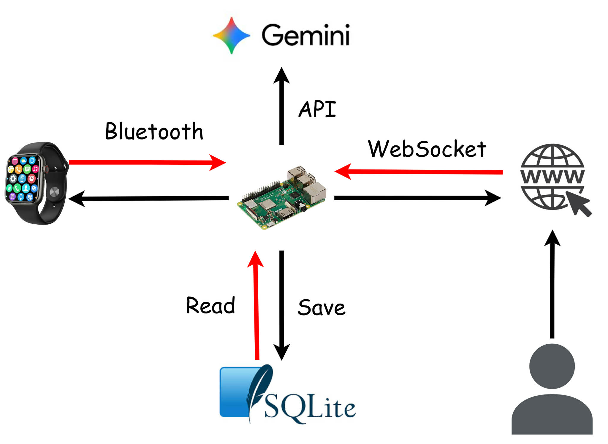
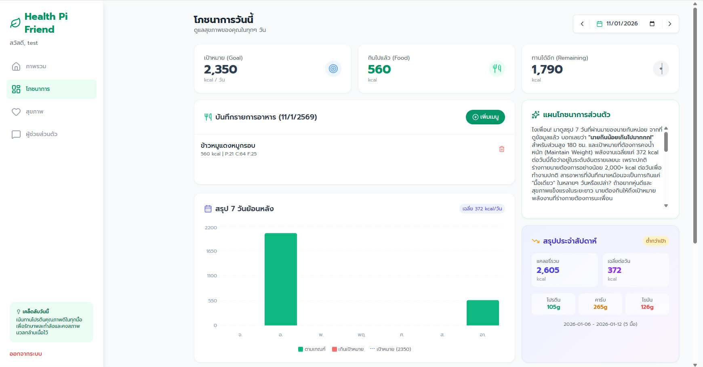
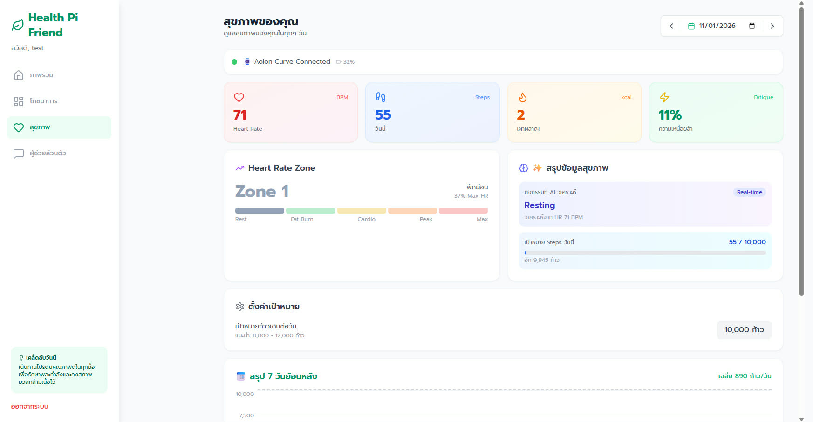

# รายงานโครงงานรายวิชา ENG23 3054 ระบบปฏิบัติการ
**หัวข้อโครงงาน (ภาษาไทย):** ระบบวิเคราะห์สุขภาพบน PI
**หัวข้อโครงงาน (ภาษาอังกฤษ):** HEALTH PI FRIEND

---

## 📋 ข้อมูลเบื้องต้น

| รายละเอียด | ข้อมูล |
| :--- | :--- |
| **รายวิชา** | ENG23 3054 ระบบปฏิบัติการ (Operating Systems) |
| **กลุ่มที่** | 4 |
| **กลุ่มเรียนที่** | 2 |
| **สาขาวิชา** | วิศวกรรมคอมพิวเตอร์ สำนักวิชาวิศวกรรมศาสตร์ |
| **สถาบัน** | มหาวิทยาลัยเทคโนโลยีสุรนารี |
| **ปีการศึกษา** | 2568 |

### 👥 คณะผู้จัดทำ

| ลำดับ | ชื่อ - สกุล | รหัสนักศึกษา |
| :---: | :--- | :--- |
| 1 | นายธีระพัฒน์ แสวงดี | B6615574 |
| 2 | นางสาวพิมพ์นารา อดุลจันทรศร | B6639334 |
| 3 | นางสาววรรณลักษณ์ ไชยเพ็ชร | B6643607 |
| 4 | นายพรศิริ ถาบุญศรี | B6643904 |

---

## 📑 สารบัญ
1. [บทคัดย่อ (Abstract)](#บทคัดย่อ)
2. [วัตถุประสงค์ (Objectives)](#1-วัตถุประสงค์)
3. [ทฤษฎีที่เกี่ยวข้อง (Related Theories)](#2-ทฤษฎีที่เกี่ยวข้อง)
4. [การออกแบบ (System Design)](#3-การออกแบบ)
5. [ผลการดำเนินงาน (Results)](#4-ผลการดำเนินงาน)
6. [สรุปผลและข้อเสนอแนะ (Conclusion)](#5-สรุปผลการดำเนินงานและข้อเสนอแนะ)
7. [เอกสารอ้างอิง (References)](#เอกสารอ้างอิง)

---

## บทคัดย่อ
> *ที่มาและความสำคัญ*

ปัจจุบัน การประยุกต์ใช้เทคโนโลยีในการติดตามข้อมูลด้านสุขภาพ อาทิ อัตราการเต้นของหัวใจ และกิจกรรมทางกายภาพ ได้กลายเป็นส่วนหนึ่งของวิถีชีวิตของผู้คนในวงกว้าง อย่างไรก็ตาม ในทางปฏิบัติ ข้อมูลดังกล่าวยังขาดการบูรณาการร่วมกับข้อมูลด้านพฤติกรรมการบริโภคอาหาร ซึ่งถือเป็นปัจจัยสำคัญที่ส่งผลต่อการมีสุขภาพที่ดีอย่างยั่งยืน

ด้วยเหตุนี้ คณะผู้จัดทำจึงได้พัฒนาระบบที่สามารถรวบรวมและเชื่อมโยงข้อมูลจากอุปกรณ์อัจฉริยะเข้ากับข้อมูลการบันทึกการบริโภคอาหาร โดยอาศัยเทคโนโลยีปัญญาประดิษฐ์ (Artificial Intelligence: AI) เป็นกลไกหลักในการวิเคราะห์ข้อมูล ทั้งนี้เพื่อให้สามารถนำเสนอคำแนะนำด้านสุขภาพที่มีความเหมาะสม สอดคล้องกับลักษณะเฉพาะของแต่ละบุคคล และตอบสนองต่อความต้องการของผู้ใช้งานได้อย่างมีประสิทธิภาพ

---

## 1. วัตถุประสงค์
1.  เพื่อให้ผู้ใช้สามารถบันทึกการบริโภคอาหารรวมทั้งติดตามปริมาณแคลอรี่ที่ได้รับในแต่ละวัน เเละติดตามผลได้สูงสุด 7 วัน 
2.  เพื่อให้ผู้ใช้ติดตามจำนวนก้าวเดินและแคลอรี่ที่เผาผลาญได้ย้อนหลัง 7 วัน 
3.  เพื่อให้ผู้ใช้สามารถตั้งคำถาม เเละได้รับคำแนะนำที่เหมาะสม จาก เเชท AI เช่น ควรบริโภคอะไรเพิ่ม หรือควรออกกำลังกายเท่าไหร่
4.  เพื่อเก็บข้อมูล อัตราการเต้นของหัวใจ ก้าวเดิน เเละเเสดงผลเเบบเรียลไทม์

## 2. ทฤษฎีที่เกี่ยวข้อง
> *อธิบายหลักการ ทฤษฎี หรือเทคโนโลยีที่นำมาใช้ในโครงงานนี้*

### 2.1. Raspberry Pi 3 Model B+
* Raspberry Pi เป็นคอมพิวเตอร์ขนาดเล็กพัฒนาขึ้นโดยมูลนิธิ Raspberry Pi ซึ่งเป็นองค์กรการกุศลของสหราชอาณาจักรที่ทำงานเพื่อนำพลังด้านดิจิตอลเข้าสู้ผู้ใช้งานทั่วโลก ดังนั้นผู้ใช้งานสามารถทำความเข้าใจและสร้าง โลกดิจิทัลเพิ่มขึ้นได้โดยง่าย สามารถแก้ปัญหาต่าง ๆ ที่สำคัญได้และเตรียมพร้อมสำหรับงานในอนาคต ซึ่ง Raspberry Pi เป็นคอมพิวเตอร์ที่มีประสิทธิภาพสูง ราคาประหยัด และมีประสิทธิภาพสูงที่ผู้คนใช้เพื่อเรียนรู้ในการแก้ปัญหาและได้รับความสนุกสนาน อีกทั้งมีชุมชนออนไลน์พัฒนาแหล่งข้อมูลฟรี เช่น บทความ ตัวอย่างโครงงาน เพื่อช่วยให้ผู้คนเรียนรู้เกี่ยวกับคอมพิวเตอร์และวิธีการทำสิ่งต่าง ๆ กับคอมพิวเตอร์ ไม่ว่าจะใช้งานด้านทั่วไป หรือ ทักษะการเขียนโปรแกรม ซึ่งสามารถประหยัดค่าใช้จ่ายในการเรียนรู้ โดยเฉพาะการเขียนโปรแกรม 
* คุณสมบัติของ Raspberry Pi (Raspberry Pi3 Model B+) 
Raspberry Pi สามารถเชื่อมต่อระบบเครือข่ายแบบใช้สายหรือไร้สายได้ ทำให้กลายเป็นอุปกรณ์ Internet of Things โดยสมบูรณ์ ช่วยให้นักวิจัยและผู้ที่สนใจอื่น ๆ สามารถนำไปประยุกต์ใช้เพื่อเชื่อมต่อกับ ตัวตรวจจับ (Sensor) ในการเก็บข้อมูลตามต้องการ รวมถึงสามารถเชื่อมต่อกับแป้นพิมพ์และเมาส์ได้ง่ายอีกด้วย โดยระบบปฏิบัติการที่ใช้นั้น คือ Raspbian ซึ่งเป็นระบบปฏิบัติการ Linux เป็นฐานถูกปรับแต่งมาใช้กับ Raspberry Pi โดยเฉพาะ และระบบปฏิบัติการ ติดตั้งผ่าน Micro SD Card สามารถตั้งค่าเป็นเครื่องแม่ข่าย และใช้งานบริการต่าง ๆ เช่น Web Server, FTP Server ได้ เป็นต้น

### 2.2. SQLite
* SQLite เป็นโปรแกรมฐานข้อมูลที่มีขนาดเล็กมาก (ไม่ถึง 1MB)  เก็บฐานข้อมูลเป็นไฟล์โดยไม่จำเป็นต้องมีเซิร์ฟเวอร์ ทำให้ถูกใช้ในหลายๆ โปรแกรมหรือถูกติดตั้งลงไปในอุปกรณ์พกพาหลายชนิดๆ เช่น iPhone , Android เพื่อใช้ในการเก็บข้อมูล

### 2.3. Gemini
* Gemini คือ แบบจำลองภาษาขนาดใหญ่ (LLM)ของ Google โดยในความหมายกว้างๆ แล้ว มันคือตระกูลของ แบบจำลอง AI แบบหลายโมดอลที่ออกแบบมาเพื่อประมวลผลข้อมูลหลายรูปแบบหรือหลายประเภท รวมถึงเสียง รูปภาพ รหัสซอฟต์แวร์ ข้อความ และวิดีโอ Google กำลังทยอยผสานรวมแชทบอท Gemini เข้ากับชุดเทคโนโลยีของตน ตัวอย่างเช่น Gemini เป็นผู้ช่วยปัญญาประดิษฐ์ (AI) เริ่มต้นในโทรศัพท์ Google Pixel 9 และ Pixel 9 Pro รุ่นล่าสุด โดยเข้ามาแทนที่ Google Assistant นอกจากนี้ ใน Google Workspace Gemini ยังพร้อมใช้งานในแผงด้านข้างของ Docs เพื่อช่วยในการเขียนและแก้ไขเนื้อหา และในแผงด้านข้างของ Gmail เพื่อช่วยในการร่างอีเมล แนะนำคำตอบ และค้นหาข้อมูลในกล่องจดหมายของผู้ใช้

## 3. การออกแบบ
> *โครงสร้างระบบ (Architecture) หรือ Flowchart การทำงาน*

**แผนภาพกระบวนการทำงาน (System Flowchart)**

คำอธิบายรูปภาพ:
1. Watch	Pi	BLE (Bluetooth)	HR, Steps, Battery
2. Pi	SQLite	SQL	บันทึกข้อมูลสุขภาพ
3. Pi	Web Browser	WebSocket /ws/watch	ส่ง HR, Steps, Battery ทุก 2 วินาที
4. User	Pi	HTTP (React → FastAPI)	บันทึกอาหาร, Chat
5. Pi	Gemini	HTTP API	ส่งคำถาม + ข้อมูลสุขภาพ
6. Gemini	Pi	HTTP API	ส่งคำตอบ AI
7. Pi	Web Browser	HTTP Response	แสดงผลบนหน้าเว็บ
Watch → Pi: ใช้ Bluetooth LE (BLE) อ่าน HR, Steps, Battery
Pi → Web: ใช้ WebSocket ส่ง Real-time ทุก 2 วินาที
Pi → Gemini: ใช้ HTTP API สำหรับ AI Chat และสรุป
Pi → SQLite: บันทึกข้อมูลทุก 60 วินาที

## 4. ผลการดำเนินงาน
> *แสดงภาพหน้าจอ (Screenshots) หรือผลลัพธ์จากการรันโปรแกรม พร้อมคำอธิบาย*

* **ผลลัพธ์ที่ 1:** หน้าจอโภชนาการ (Nutrition Dashboard) แสดงข้อมูลการบริโภคอาหารประจำวัน ประกอบด้วย เป้าหมายแคลอรี่ (2,350 kcal), แคลอรี่ที่รับประทานแล้ว (560 kcal), และแคลอรี่ที่เหลือ (1,790 kcal) พร้อมรายการอาหารที่ผู้ใช้บันทึก กราฟสรุป 7 วันย้อนหลัง และแผนโภชนาการที่ AI วิเคราะห์ให้ รวมถึงการแสดงสรุปประจำสัปดาห์ที่รวบรวมข้อมูลแคลอรี่และสารอาหารที่ได้รับ
     
* **ผลลัพธ์ที่ 2:** หน้าจอสุขภาพ (Health Dashboard) แสดงข้อมูลสุขภาพที่รับจาก Smartwatch แบบ Real-time ผ่าน Bluetooth ประกอบด้วย อัตราการเต้นของหัวใจ (71 BPM), จำนวนก้าว (55 ก้าว), ระดับความเหนื่อยล้า (11%), และ Heart Rate Zone (Zone 1 - พักผ่อน) พร้อมแสดงสถานะการเชื่อมต่อนาฬิกา Aolon Curve, แบตเตอรี่ (32%), เป้าหมายก้าวเดิน (10,000 ก้าว/วัน), และกราฟสรุปข้อมูลสุขภาพ 7 วันย้อนหลัง
     

## 5. สรุปผลการดำเนินงานและข้อเสนอแนะ

### 5.1 สรุปผลการดำเนินงาน
ระบบ Health Pi Friend ได้รับการพัฒนาขึ้นเพื่อเป็นระบบติดตามสุขภาพและโภชนาการส่วนบุคคล โดยใช้ Raspberry Pi เป็นอุปกรณ์ประมวลผลหลัก และสามารถเชื่อมต่อกับอุปกรณ์สวมใส่ (Smartwatch) ผ่านเทคโนโลยี Bluetooth Low Energy (BLE) เพื่อรับข้อมูลสุขภาพแบบ Real-time

ด้านการรับข้อมูลสุขภาพ
ระบบสามารถรับข้อมูลจาก Smartwatch ได้อย่างต่อเนื่อง ประกอบด้วย อัตราการเต้นของหัวใจ (Heart Rate), จำนวนก้าวเดิน (Steps), และแคลอรี่ที่เผาผลาญ (Calories Burned) โดยใช้เทคโนโลยี WebSocket ในการส่งข้อมูลจาก Server ไปยัง Web Application แบบ Real-time ซึ่งช่วยลดความล่าช้าในการแสดงผลและเพิ่มประสบการณ์การใช้งานที่ดีขึ้น นอกจากนี้ระบบยังมีกลไก HTTP Polling เป็นตัวสำรองในกรณีที่การเชื่อมต่อ WebSocket ไม่สามารถทำได้ ข้อมูลเหล่านี้จะถูกบันทึกลงฐานข้อมูลและแสดงผลเป็นกราฟสรุปย้อนหลัง 7 วัน เพื่อให้ผู้ใช้สามารถติดตามการเปลี่ยนแปลงของสุขภาพได้อย่างสะดวก

ด้านการบันทึกโภชนาการ
ผู้ใช้สามารถบันทึกอาหารที่รับประทานในแต่ละมื้อ โดยระบบจะคำนวณปริมาณแคลอรี่ โปรตีน คาร์โบไฮเดรต และไขมันที่ได้รับ พร้อมเปรียบเทียบกับเป้าหมายที่ระบบคำนวณให้โดยอัตโนมัติ โดยใช้สูตร Mifflin-St Jeor ในการคำนวณอัตราการเผาผลาญพลังงานพื้นฐาน (BMR) และปรับตามระดับกิจกรรมและเป้าหมายของผู้ใช้

ด้านการวิเคราะห์ด้วย AI
ระบบได้ผสานเทคโนโลยีปัญญาประดิษฐ์ (AI) จาก Google Gemini API เพื่อวิเคราะห์ข้อมูลสุขภาพและโภชนาการของผู้ใช้ โดยสามารถให้คำแนะนำเฉพาะบุคคลผ่านช่องแชท รวมถึงสร้างเคล็ดลับสุขภาพประจำวัน (Daily Tips) และสรุปภาพรวมสุขภาพอัตโนมัติ

### 5.2 ปัญหาและข้อเสนอแนะ
* **ปัญหาที่พบ:**
     1. ข้อจำกัดของนาฬิกา Aolon curve MOY-8ID2-2.0.9 คือจะตัดสัญญาณ Bluetooth
     2. Raspberry Pi ไม่ได้ถอดปลั๊ก แต่เครือค่าย Raspberry Pi หาย
* **ข้อเสนอแนะ:** 
    1.  ควรเลือกใช้ Raspberry Pi เวอร์ชั่นใหม่เพราะจะทำให้การประมวลผลรวดเร็วขึ้น
    2.  ควรใช้ Wi-Fi ที่มีความเสถียรเพื่อทำให้อุปกรณ์ทำงานได้อย่างเต็มที่

---

## เอกสารอ้างอิง

1.  Choonewza. (2018). *การติดตั้งและตั้งค่าระบบ Raspberry Pi 3 Model B+*. สืบค้นเมื่อ 6 มกราคม 2569, จาก https://choonewza.medium.com/
2.  วสันต์ ลิ่วลมไพศาล. (2022). *SQLite ฐานข้อมูลขนาดเล็กที่ศักยภาพมากกว่าที่คิด*. สืบค้นเมื่อ 11 มกราคม 2569, จาก https://www.mfec.co.th/tech-talk/sqlite
3.  Rina Diane Caballar IBM. (2024). *Google Gemini คืออะไร?*. สืบค้นเมื่อ 11 มกราคม 2569, จาก https://www.ibm.com/think/topics/google-gemini
4.  bleak. (2023). *Bluetooth Bleak*. สืบข้อเมื่อ 11 มกราคม 2569, จาก https://bleak.readthedocs.io/en/latest/
5.  Manuals+. (2021). *คู่มือการใช้งานสมาร์ทวอทช์ Aolon GT5 Pro Aolon GT5 Pro*. สืบค้นเมื่อ 11 มกราคม 2569, จาก https://manuals.plus/th/aolon/gt5-pro-smart-watch-manual-3
6.  Medscape. (2020). *Medscape*. สืบค้นเมื่อ 12 มกราคม 2569, จาก https://www.medscape.com/

